# 📘 ApplicationFlow

## 🎯 Purpose
This document outlines the end-to-end application flow for the **Interview Ignitor AI Agent**, guiding candidates from uploading their resume and job description to preparing for interviews using AI-powered tools.

---

## 🧭 Application Flow

### 1. 🏠 Homepage – Upload Resume and Job Description
- The user lands on the homepage.
- User uploads their **Resume (PDF/Docx)** and **Job Description (PDF/Docx)** using a drag-and-drop or file picker interface.
- Files are submitted to the backend for processing.

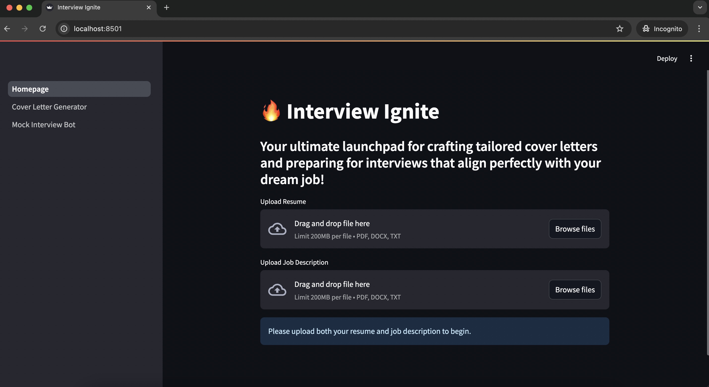

---

### 2. 🤖 Document Analysis by Interview Ignitor AI Agent
- Once uploaded, the **AI Agent** processes both documents.
- It extracts key information such as:
  - Candidate’s experience, skills, and education from the resume.
  - Job requirements, qualifications, and role expectations from the job description.

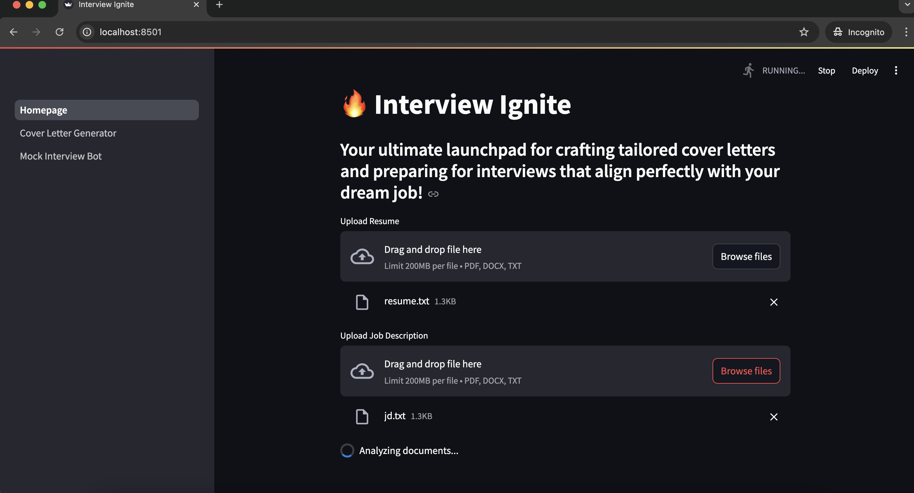

---

### 3. 📝 Summary Generation
- A summary is displayed to the user:
  - **Resume Summary**
  - **Job Description Summary**
  - **Identified Resume Skills**

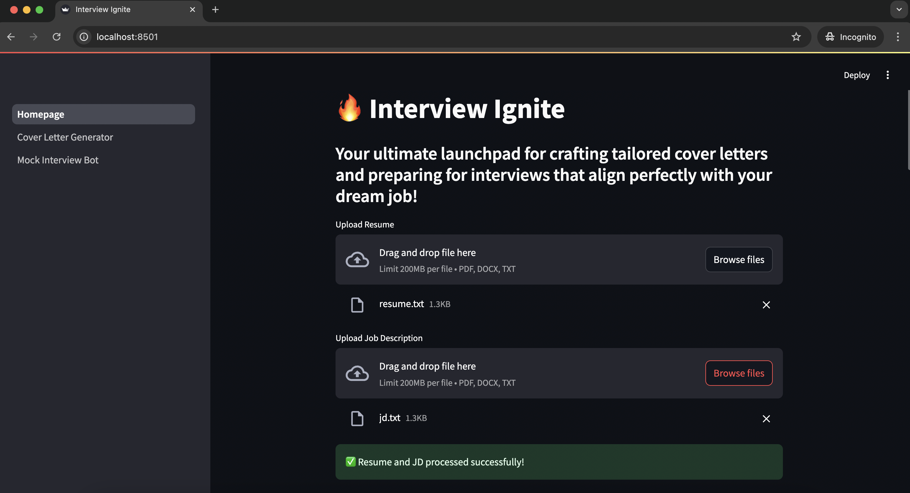

---

### 4. 📄 Cover Letter Generator
- User clicks on **“Cover Letter Generator”** in the sidebar.
- The AI Agent uses the generated summaries and skills to craft a **personalized cover letter** tailored to the job.

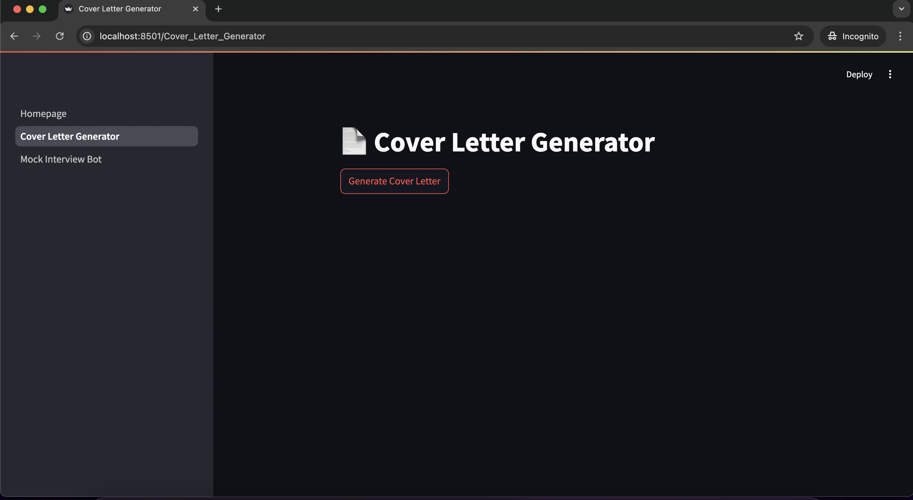

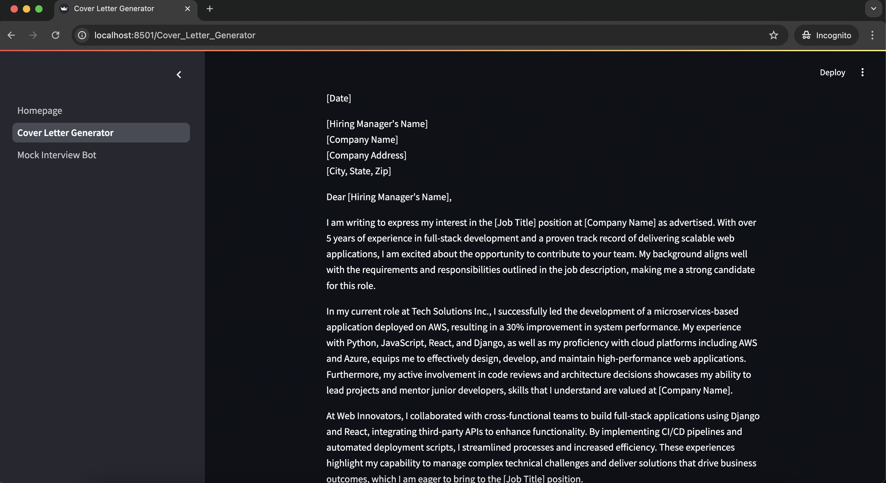

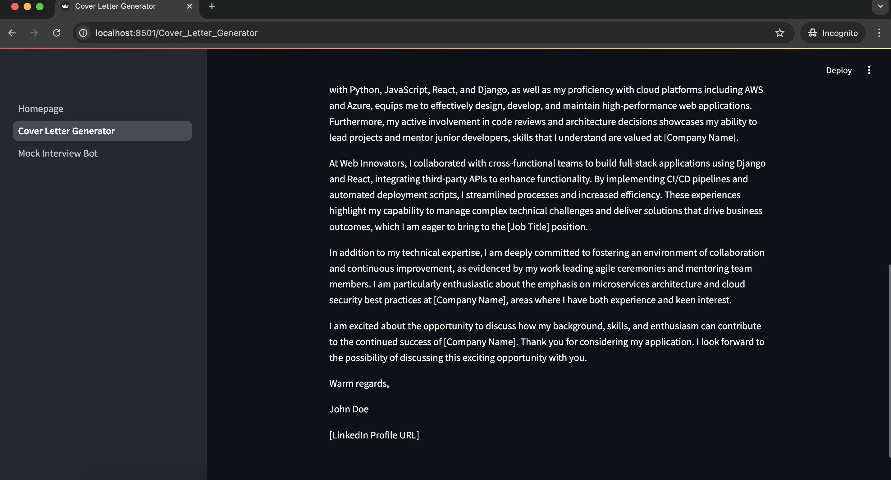

---

### 5. 🧠 Mock Interview Bot
- User navigates to **“Mock Interview Bot”** in the sidebar.
- The bot initiates the mock interview experience.

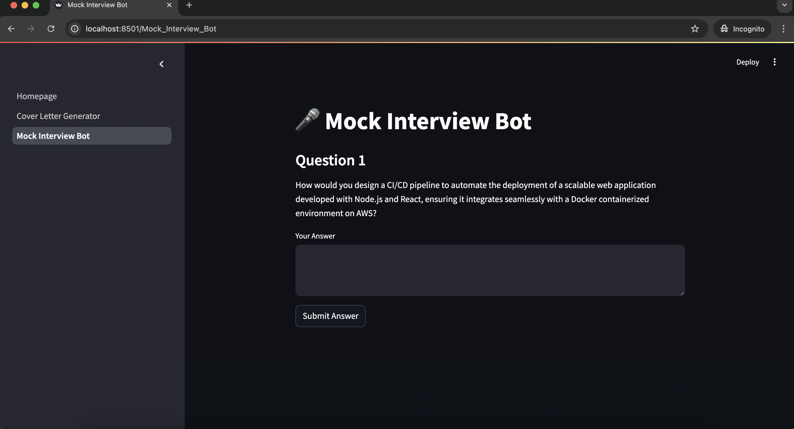

---

### 6. ❓ Question & Answer Interaction
- The AI generates a question:
  - Based on **Resume & Job Description** or just **Resume Skills** (randomly).
- Candidate submits an answer in the text box.

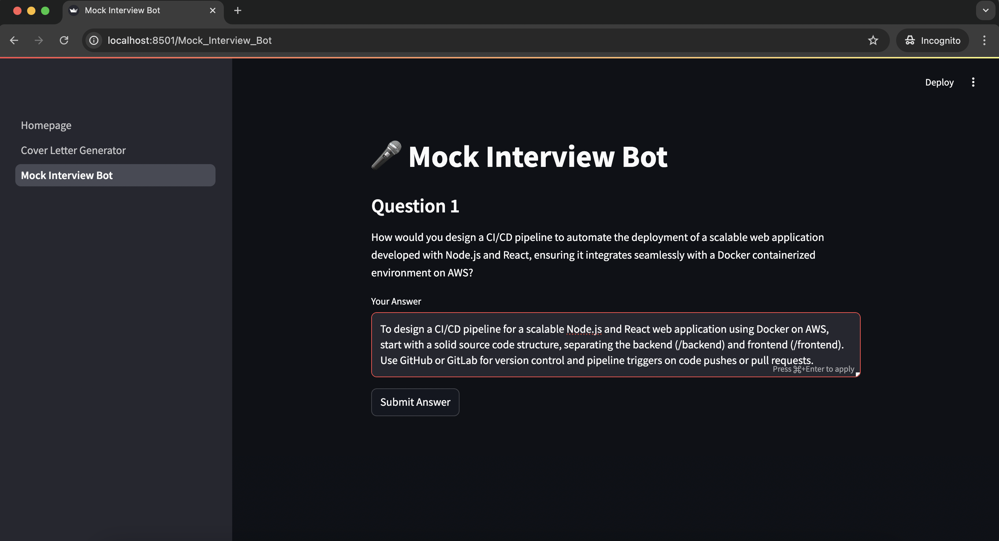

---

### 7. 🧪 Evaluation
- The AI evaluates the submitted answer.
- It provides:
  - A **score from 1 to 10**
  - Constructive **feedback**
  - A **sample ideal answer** for learning purposes.

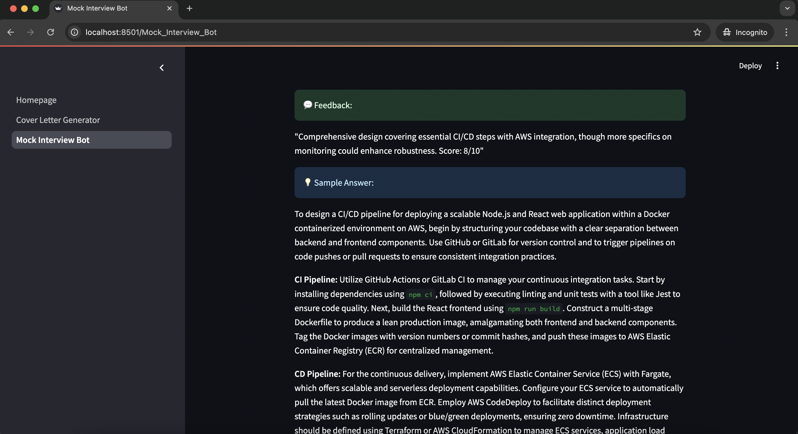

---

### 8. 🔁 Continue Mock Interview
- Candidate clicks **“Next Question”** to proceed.
- Steps 6–7 repeat, allowing continuous practice.

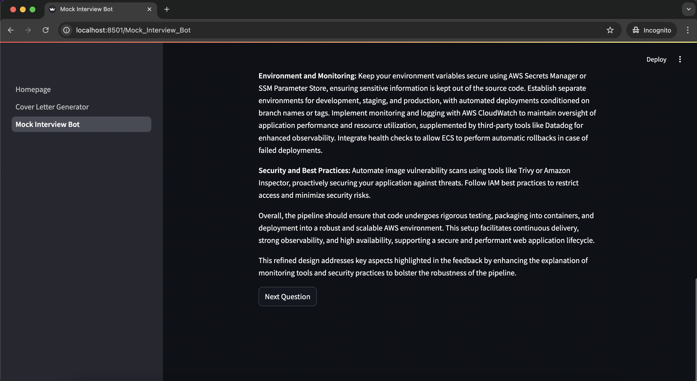

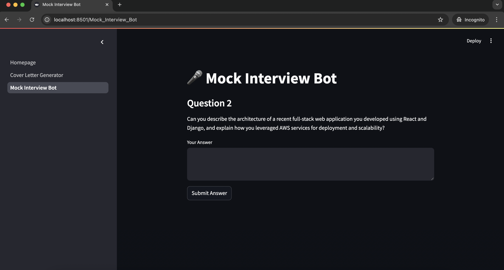

---

## ✅ Summary
The application provides a seamless experience for job seekers, combining resume analysis, personalized content generation, and interactive mock interviews — all driven by the Interview Ignitor AI Agent.
